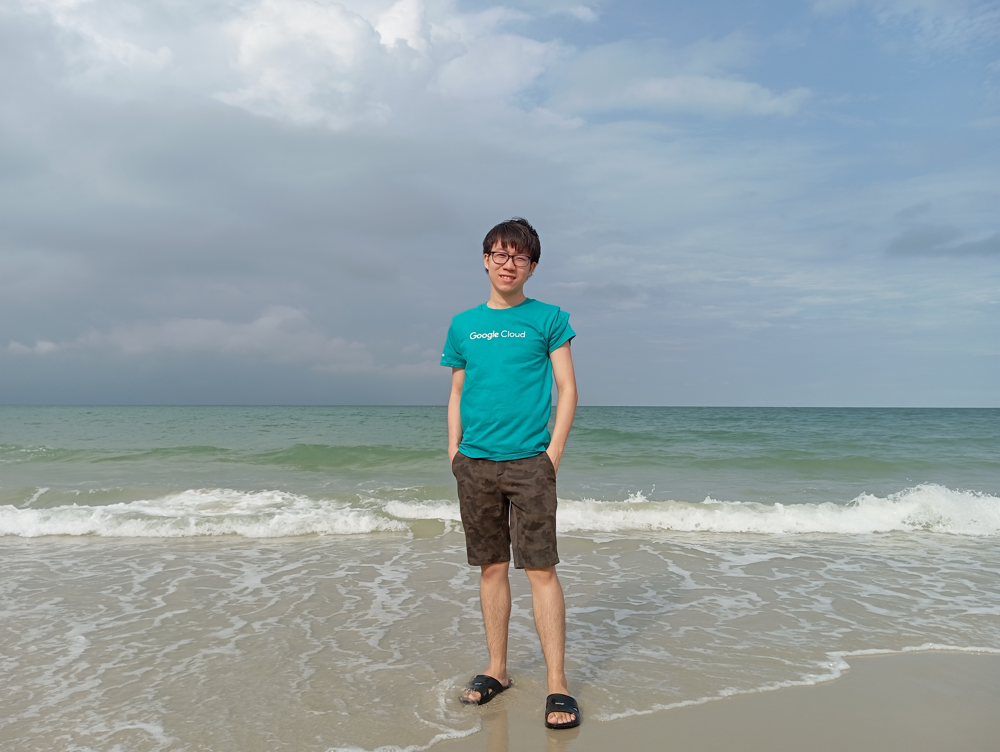

# Introduction
Hi! I'm Kuek Zi Lii, a student in the Software Maintenance and Evolution course.
I expect to learn a lot about modern software maintenance practices and how to work with legacy systems.
- **Fun fact**: I love playing chess in my free time.
- **Course expectations**: To gain hands-on experience in maintaining and evolving software.
 <!-- Link to the uploaded image -->
## GitHub Profile
You can view my personalized GitHub profile
[here](https://github.com/eren1106).